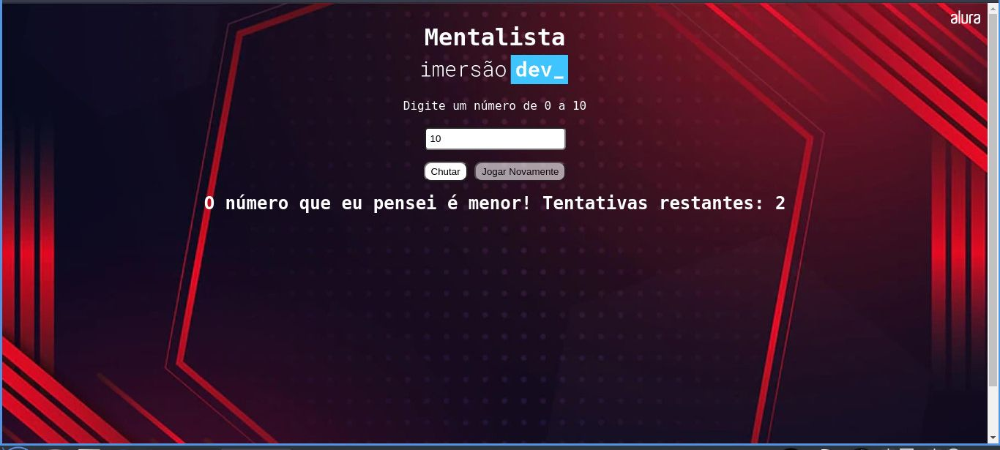

<h1 align="center"> Mentalista </h1>  

  

  Descubra o número em que estou pensando!

<!-- START doctoc generated TOC please keep comment here to allow auto update -->
<!-- DON'T EDIT THIS SECTION, INSTEAD RE-RUN doctoc TO UPDATE -->
## Table of Contents

- [Introdução](#introduction)
- [Feedback](#feedback)
- [Como jogar](#comojogar)

<!-- END doctoc generated TOC please keep comment here to allow auto update -->

## Introdução

O mentalista é um jogo de adivinhação desenvolvido durante a Imersão Dev da Alura. São dadas 3 tentativas ao usuário para que ele possa descobrir o número "pensado" pelo computador.

## Feedback

Leu o código fonte e gostaria de dar algum feedback? Fique à vontade, ficarei muito feliz de saber em que posso melhorar!

## Como jogar

Acesse o projeto através do link tal e divirta-se!

